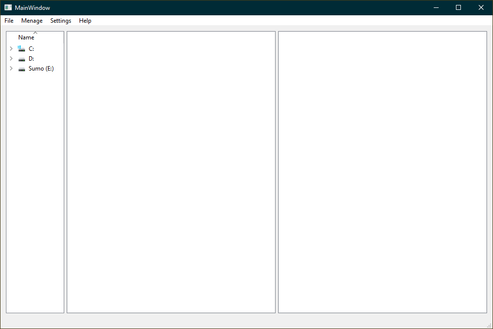
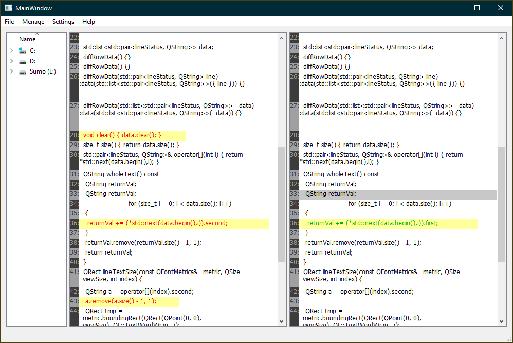
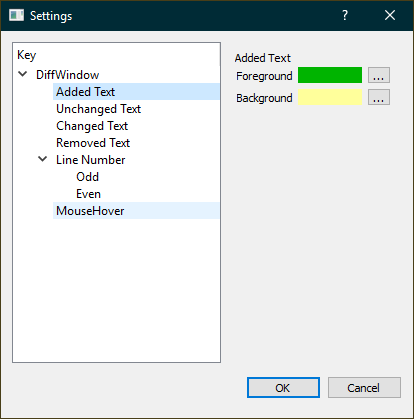
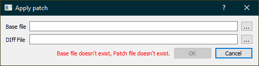
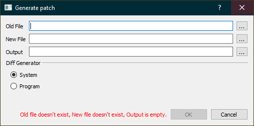

# VersionControl
## Todo:
- [x] Gui using QT library
- [x] Ability to use system specific diff
- [x] Own implementation of diff
- [x] Specific linux tests

## Gui implementation:

* Main window:
  * Empty
  
  * Filled
  
* Settings:

  
* Patch:
  * Apply
  
  * Generate
  
